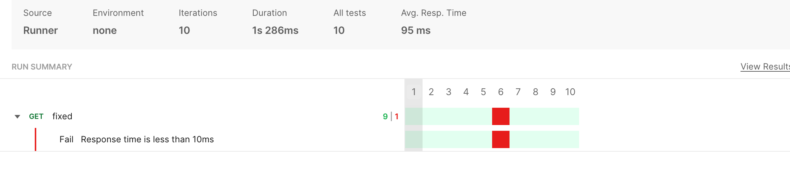
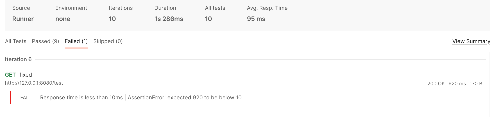

## Test with spring

All requests, except the sixth one, exhibited response times of less than 10 milliseconds during my testing.

The response for the sixth request occurred after acquiring the lock without any delay or sleep
